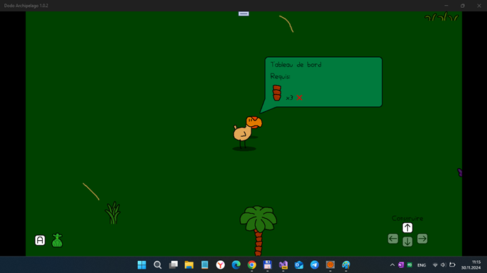
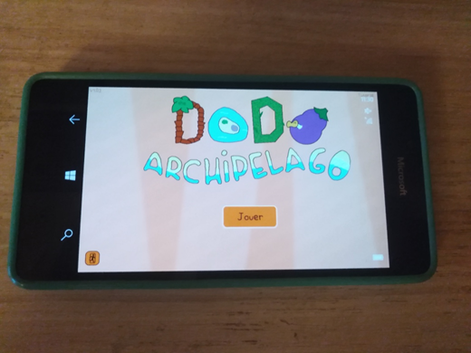

# DodoArchipelago 1.0.1 - dev branch

## About

It's only PoC (Proove-of-Concept). No consumer details. Devs only. 

Game play is very specific ("strange random world exploration/generation"). The project is in alpha state (early bird / proto -  memory leaks, hangs/halts, etc.)

This is my *veeery quuuick* UWP "port" of [The Dodo Archipelago](https://rouli.itch.io/the-dodo-archipelago) game.  So, at now it only "walker" (use WASD ad L.Control for SuperDodo activation :))))

Main goal: do more exploration of special game "frameworks" such FMOD and port it to Windows 10 Mobile.... However, Andromeda-like x86/x64-cpu based tablet (with keyboard) is best thing for this game, I think ;)

## Screenshot(s)

## Words from the author(s)

"

The Dodo Archipelago is a chill exploration game about a lone dodo on a mysterious archipelago. Build a village from scratch using the multiple ressources on the islands.

Here's what you can expect:

- Walk, swim and bike to travel through various landscapes
- 1-2h of gameplay
- Music by Jananass and meliméa
- Unique art style

"

- Rouli & meliméa

## Tech. details / more info
- Janre:	Adventure
- Game "engine":	MonoGame
- Labels:	2D, chill, Cute, Exploration, Singleplayer
- Languages:	English, French
- Type of control:	Keyboard (mouse and touchpanel planned)
- Original game focused (targeted) to Windows classic (desktop) , my project is UWP (Hello, Xbox, and Windows 10 Mobile!) 

## Status of my DodoArchipelago porting
- Main W10M device : Lumia 950; sdk 15063+ (Last)  - init state
- Secondary W10M device : sdk 10240 (Astoria) - init state
- Game build status - ok, and main game mode seems to be ok :)
- Sound effects partially fixed (effects ok, but no background misic at now)
- Original kbd control still presend for desktop mode 
- No Screen scaling for non-follscreen mode.
- Experimentation (debugging) with special "Debug panel" (blocked in *main* branch, available in *dev* branch)
- world generator reconstructed by me, and... game logics cardinally changed (DoDo "clone" NPC discovered and shown)))

## Known problems
- Not all sound effects work good (strange bug with *null* items at soundeffect list)
- No background music
- Textures (tiles) are huge (so, no W10M compatibility at now!)
- No TouchPanel (touchscreen) support
- Intro cutted (no multi-threading in WinSDK 10240)
- World repairing promblem (Game "forget the world" after restarting and regenerates it...)
- No story cutscenes 
- No upgradable buildings (only "inventary" parst is ready)

## ToDo
- Fix Assets (some xnb bugs detected)
- Fix no sound problem
- Fix some graphics and fx effects!
- Fix another 100500 bugs :)
- NPC?
- Game localization(s) 

## References
- https://rouli.itch.io/the-dodo-archipelago Original DoDo Archipelago game (x86, desktop)
- https://rouli.itch.io DoDo Archipelago's itch.io home page
- https://github.com/Rouli-M One of Original DoDo's programmers/devs
- https://github.com/Rouli-M/ReturnOfTheFrogarians (Additional project to research)

## .
As is. No support. Learn purposes only. DIY!

## ..
[m][e] Feb 2024
