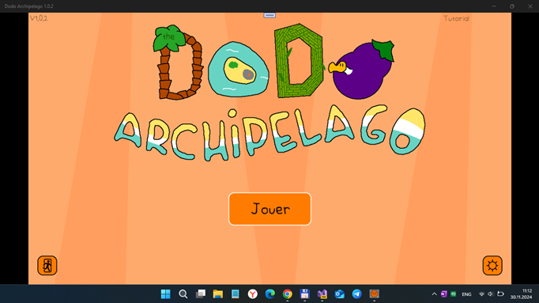

# DodoArchipelago 1.0.2 - dev branch

## About

It's only PoC (Proove-of-Concept). No consumer details. Devs only. 

Game play is very specific ("strange random world exploration/generation"). The project is in alpha state (early bird / proto -  memory leaks, hangs/halts, etc.)

This is my *veeery quuuick* UWP "port" of [The Dodo Archipelago](https://rouli.itch.io/the-dodo-archipelago) game. Many original features are lost (not realized yet)). Mainly, it's only "walker" for PC/tablet devices (use WASD ad L.Control for SuperDodo activation :)))) 

Main goal: do more exploration of special "game frameworks" such FMOD and port it to Windows 10 Mobile. 

Also,  mature gamedev experience is very useful too! 

## Screenshot(s)

## Words from the author(s)

"

The Dodo Archipelago is a chill exploration game about a lone dodo on a mysterious archipelago. Build a village from scratch using the multiple ressources on the islands.

Here's what you can expect:

- Walk, swim and bike to travel through various landscapes
- 1-2h of gameplay
- Music by Jananass and meliméa
- Unique art style

"

- Rouli & meliméa

## Tech. details / more info
- Janre:	Adventure
- Game "engine":	MonoGame
- Labels:	2D, chill, Cute, Exploration, Singleplayer
- Languages:	English, French
- Type of control:	Keyboard / Touchpanel / "Joypad" (not tested by me, no joystick))
- Original game focused (targeted) to Windows classic (desktop) , my project is UWP (Hello, Xbox, and Windows 10 Mobile!) 

## Status of my DodoArchipelago porting
- Main W10M device : Lumia 950; sdk 15063+ - bad borders of game , core window 
- Secondary W10M device : Lumia 640; sdk 10240 (Astoria) -  - bad borders of game , core window 
- Game build status - ok, and main game mode seems to be ok :)
- Sound effects partially fixed (effects ok, but no background misic at now)
- Multi-control support realized (keyboard+touchpanel+joystick) 
- Screen scaling simms to be ok (but not 100% tested )
- Experimentation (debugging) with special "Debug panel" (blocked in *main* branch, available in *dev* branch)
- world generator reconstructed by me, and... game logics cardinally changed (DoDo "clone" NPC discovered and shown)))
- compatibility with Visual Studio 2017 IDE (for brave real WinPhone/Lumia device debug!)))
- build point No 1 added! 
- build action (operation) unblocked :)
- pre-gaming cutscene partially recovered (but I cutted some big textures)))

## Known problems
- Not all sound effects work good (strange bug with *null* items at soundeffect list)
- No background music
- Background textures (tiles) are huge (so, disable tiles for W10M compatibility)
- Intro cutted (no multi-threading in WinSDK 10240)
- World full repairing problem (Game "partally forget the world data" after restarting and regenerates it...)
- No story cutscenes 
- No upgradable buildings (only "inventary" parst is ready)
- Improper screen borders.
- Miracle stored "Game" at Slot 1 (needs to be deleted:)

## ToDo
- Fix Assets (some xnb bugs detected)
- Fix no sound problem
- Fix some graphics and fx effects!
- Fix another 100500 bugs :)
- NPC?
- Game localization(s)  
- Fix screen distortion(s) (very strange resolutions)
- Fix game cutscene(s)
- unblock hidden Editor GUI (?)
- fix appearing of Game in Slot 1 after fist app run/start! :)

## References
- https://rouli.itch.io/the-dodo-archipelago Original DoDo Archipelago game (x86, desktop)
- https://rouli.itch.io DoDo Archipelago's itch.io home page
- https://github.com/Rouli-M One of Original DoDo's programmers/devs
- https://github.com/Rouli-M/ReturnOfTheFrogarians (Additional project to research)
- https://learn.microsoft.com/en-us/visualstudio/get-started/csharp/tutorial-uwp?view=vs-2022 (Microsoft's UWP tutorial for beginners & "oldschoolers" like me)))

## .
As is. No support. Learn purposes only. DIY!

## ..
[m][e] Feb 2024
